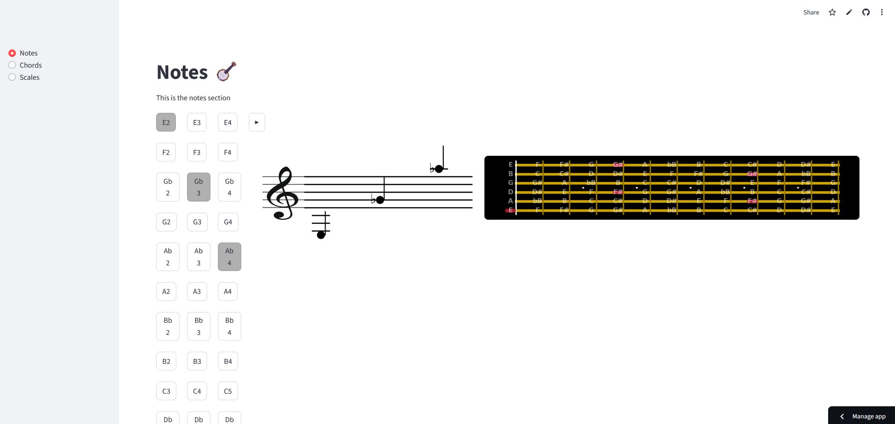
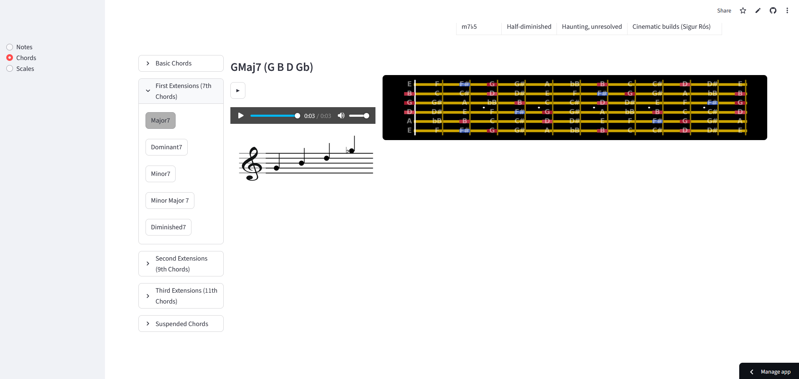
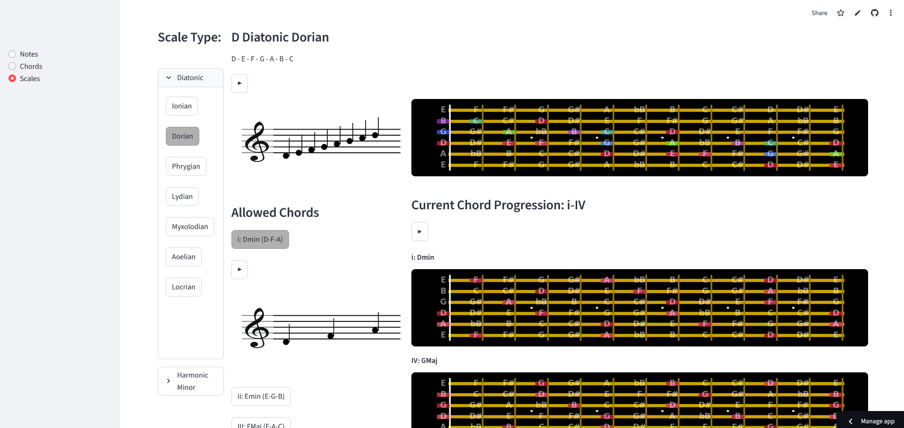

# guitar_0
This project serves to help me improve my guitar skills and to keep track of my current knowledge in music theory. The ultimate goal is to be able to improvise. Other goals that follow along include the training of the ear to distinguish notes as well as being able to write your own chord progressions and consequently your own songs.  
You can access the tool on the following site: 
https://guitar00.streamlit.app/

The interface for the "Notes"-tab looks like this: 

It consists of buttons for the 3 octaves that one can play on the fretboard up to the 12th fret on the 6th string. Next to it, it will display the note in the standard music table as well as its position on the fretboard. 

The interface for the "Chords"-tab looks like this: 

You can pick your root and the type of chord you want to play on top of that root. There is also the option to listen to that chord and train your ear. Notes of extended chords are highlighted in a different color. Two AI-generated summaries of the type of emotions the chords convey are added to give inspiration when coming up with chord progressions. 

The interface for the "Scales"-tab looks like this: 

You can pick your root and the type of scale you want to play on top of that scale. So far, I only included Diatonic and Harmonic Minor Scales. Next to the notes making up the scale one can also see the allowed chords and can immediately start writing a chord progression by clicking on the allowed chords buttons. 
